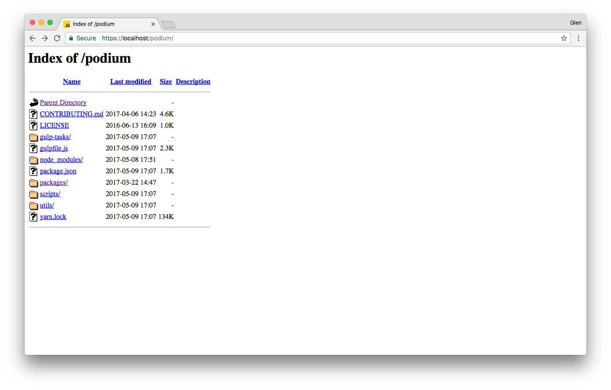
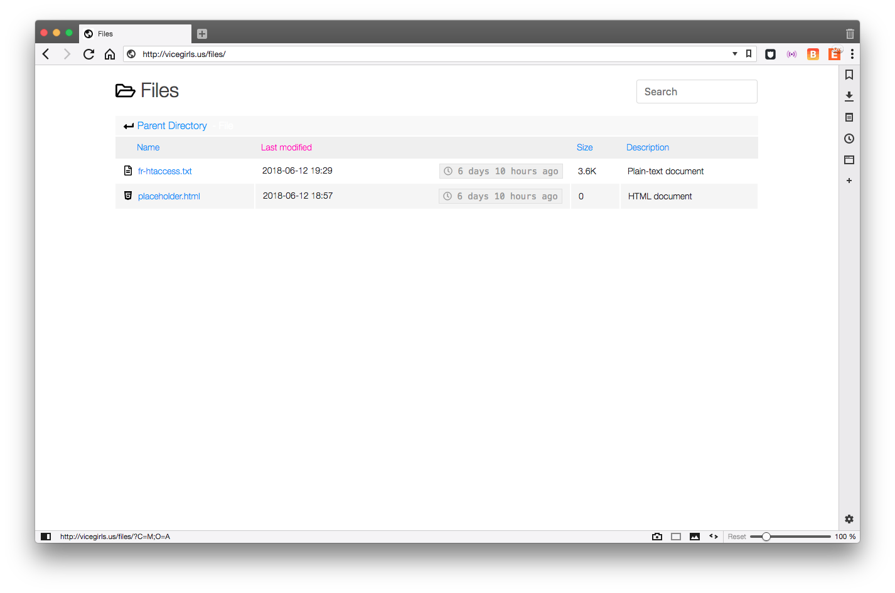

# Poshapache

A responsive, modern Apache index page. *Forked from [Fancy Index](https://github.com/Vestride/fancy-index "GitHub: Fancy Index").*

Apache HTTP Server -- while both a resilient and reliable staple of the internet -- hasn't aged particularly well in some respects. Although production web servers rarely enable this feature (why give someone the opportunity to snoop around?), an obvious example of Apache's age can be found in its outdated index page.

### Before Poshapache:

### After Poshapache:

Sure, this may not be a top priority for every Apache "webmaster" out there, but some of us are a little superficial. Ugly things don't *have* to be ugly. That's where Poshapache comes in.

## Setup

==*Apache installations can vary quite significantly between systems, so for now this setup guide will assume you're using the standard configuration for a particular platform.*==

### Ubuntu / Debian Setup

1. Clone this repo or [download](https://github.com/vicegirls/poshapache/archive/master.zip "Download PoshApache") and extract the archive.

~~~git
git clone https://github.com/vicegirls/poshapache.git
~~~

2. Copy/move the folder `_posh` into the desired location on your web server.

#### Configuring Apache (>=2.4) -- poshapache.conf (Recommended)

==*These instructions assume you're using Apache version 2.4 or greater. Instructions for earlier versions, if different, can be written by someone that uses an earlier version.*==

For a variety of reasons, Apache documentation [recommends](http://httpd.apache.org/docs/2.4/howto/htaccess.html#when "When to use .htaccess") avoiding the use of `.htaccess` files whenever possible. One important reason is performance / resource consumption, which should be a concern in any production server environment. When Apache is configured to allow `.htaccess` files, the server recursively scans directories for the files regardless if you're actually using them. Furthermore, the relevant `.htaccess` file is loaded every time a document is requested.

*If you have total control of your web server, there is no reason to use `.htaccess`; however, ==if you want to use PoshApache in a shared hosting environment and your host allows .htaccess, skip to the next section==.*

1. Copy/move the file `poshapache.conf` into the `conf-available` folder of your *ServerRoot*. The default location on a typical Ubuntu installation is `/etc/apache2/conf-available`.
2. From the command line, create a *symbolic link* pointing to `poshapache.conf` in the adjacent `conf-enabled` directory and restart the daemon. Assuming `conf-available` is your *cwd*, enter the following:

~~~bash
sudo ln -rsv poshapache.conf ../conf-enabled/poshapache.conf
sudo apache2ctl restart
~~~

To test the installation, use a web browser and navigate to a folder on your server without an `index.html` file. You can also copy/move the folder `test` to your server -- it contains a variety of empty documents with different extensions. If Apache returned an error message related to PoshApache when you tried to restart it, please post the issue in the repo.

---

#### Configuring Apache (>=2.4) on Shared Hosting (.htaccess)

==*Your web host must have enabled the use of `.htaccess` and the overriding of certain settings for PoshApache to work. You should contact them if you're unsure or think you can change their minds.*==

1. Copy/move the `.htaccess` file from the package into the root directory of your web server (or a specific directory you want to have indexed with PoshApache).
2. If you require your host to change the server configuration to enable `.htaccess` appropriately, tell them you'll need them to add something like this to your virtual host config:

~~~apache
<Directory "/path/to/your/vhost">
    AllowOverride All
    Options Indexes MultiViews FollowSymLinks
    Require all granted
</Directory>
~~~

After all of that, you'll have to restart Apache if you can. If you have sudo (and you probably don't if you're on a shared host): `sudo apache2ctl restart`.

Some plausible reasons you'd have trouble or don't see the correct files: You probably can't use PoshApache on your host because `AllowOverride` is restrictive; The installation instructions didn't apply to your server environment; You didn't restart Apache; or you're using an antiquated browser that won't run neat scripts.
